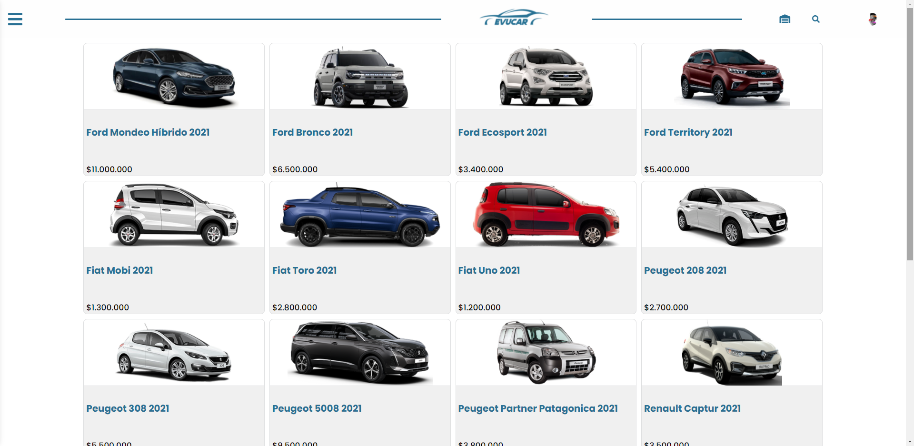

# Evucar (consecionaria)

## Objetivos del Proyecto
- Construir una App JavaScript desde cero con React.
- Afirmar y conectar los conceptos aprendidos en la carrera.
- Aprender y mejores prácticas.
- Utilizar Metodologías Ágiles.
- Trabajar en equipo.

### Requerimientos

La aplicación del Consecionario va a contar con los siguientes requerimientos:

__IMPORTANTE:__ Es necesario contar minimamente con la última versión estable de Node y NPM. Asegurarse de contar con ella para poder instalar correctamente las dependecias necesarias para correr el proyecto.

Para verificar que versión tienen instalada:

> node -v
>
> npm -v

Para levantar el proyecto primero asegurarse de tener en /src un archivo .env con las siguientes variables de entorno:

(Las variables que comienzan con DB están relacionadas a la base de datos, en este proyecto se usó postgeSQL.
Las demas variables corresponden al puerto del servidor de back-end, las Cookies, y claves.
Se debe crear una base de datos en postgres con el nombre "development" )

DB_USER =
DB_PASSWORD =
DB_HOST = 
port =
COOKIE =
apiKey =
domain =
hostF =

Para levantar el proyecto correr los siguientes: 
- npm install 
- npm start

### Historia de usuario del proyecto
##### Como un usuario invitado yo quiero...

- PRODUCTOS:
    
    + ...ver la lista del los productos, separados por categorias.
    + ...las listas de categoria separadas por , para poder ver los items en los que estoy interesado.
    + ...poder buscas productos, para encontrar rápido el veiculo que quiero comprar.
    + ...ver el detalle de un producto individual (incluida las fotos, descripciones, reviews, etc...), asi puede determinar si quiero ese producto o no.
    
    

- CARRITO:
    
    + ...poder agregar items a mi carrito de compras desde a página de detalles de un producto, para poder comprarlos despues.
    + ...sacar items de mi carrito, en caso que decida no quererlos.
    + ...editar cantidades de los items de mi carrito, en caso que quiera mas o menos cantidad de un item en particular.
    + ...refrescar la página, o irme y volver, y todavía tener mi carrito de compras (sin haberme creado una cuenta). 
    + ...poder crearme una cuenta, loguearme y seguir editando ese mismo carrito, asi no pierdo los items seleccionados.
- CHECKOUT:
    + ...poder comprar todos los items de un mi carrito.
    + ...especificar un telefono, datos personales y un email cuando hago el checkout, asi me pueden contactar para realizar una cita.
- GESTION DE CUENTA:
    + ...poder crear una cuenta, asi puede hacer otras cosas como dejar un review.
    + ...poder logearme usando Google o Github, para no tener que acordarme de un password nuevo.

Los usuarios que hayan creado su cuenta, podrán hacer todo lo que puede hacer un usuario guest y además:
###### Como un Usuario Autenticado yo quiero...

- GESTION DE CUENTA:
    + ...poder desloguearme, asi nadie más pueda usar mi sesión.
    + ...poder dejar reviews a los productos, que incluyan texto y un sistema de cinco estrellas.

### Admin

Los usuarios administradores pueden manejar el sitio, los productos que se listan y los items que están disponibles.

#### Como un administrador yo quiero...

- GESTION DE PRODUCTOS:
    + ...poder crear y editar productos, con nombre, descripción, precio y uno o más fotos.
    + ...poder agregar un producto segun categorías, para que los usuarios puedan filtrar los items.

- GESTION DE ORDENES:
    + ...poder ver una lista de todas las ventas, para poder ver y revisar las ordener.
    + ...poder filtrar as ordenes por su estado (creada, procesando, cancelada, completa).
    + ver los detalles de una orden específica, asi puedo revisarla y actualizar su estado.
    + ...poder cambiar el estado de una orden (creada => procesando, procesando => cancelada || completa).
    + ...poder editar el calendario para que pueda elegir por jornada de trabajo y meses activos.

### Validación de Datos

Cuando crees los modelos, debes considerar los tipos de datos que vas a recibir, qué cosas van a ser requeridas y cómo vas a devolver los errores a los usuarios.
Algunas constrains qué deberás implementar:

- Productos:
    + Deben tener `titulo`, `descripcion`, `precio`, `cantidad`
    + Deben pertenecer a por lo menos una categoría.
- Usuarios:
    + Deben tener una dirección de mail válida.
    + Su email debe ser único.
- Ordenes:
    + Las ordenes deben tener línea de orden que contiene el `precio`, `productId`, y `cantidad`.
    + Si un usuario completa una orden, esa orden debe mantener el precio del item al momento de la compra, sin importar que el precio del producto cambie después.
- Reviews:
    + Todas las reviews deben pertenecer a un producto.
    + Todas las reviews deben pertenecer a un usuario.
    + Todas las reviews deben tener por lo menos x caractéres.

### dependecias

- react
- redux
- react-redux
- redux-devtools
- react-router-dom
- redux-thunk
- firebase
- auth0
- styled-components
- sweetalert2

## Colavoradores en el proyecto

Gracias por todo su trabajo y ayuda en el proyecto!

<a href="https://github.com/JoaquinMPereyra" >Jaquin Pereyra</a>

<a href="https://github.com/IgnaPereyra" >Ignacio Pereyra</a>

<a href="https://github.com/JoaquinMPereyra" >Carolina Rios</a>

<a href="https://github.com/JoaquinMPereyra" >Ariadna Albornoz </a>

<a href="https://github.com/adelquis-molinari" >Adelquis Molinari </a>